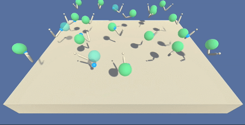

This repo is based on the [Udacity Deep Reinforcement Learning Nano Degree](https://udacity.com/course/deep-reinforcement-learning-nanodegree--nd893) project [Continuous Control](https://github.com/udacity/deep-reinforcement-learning/tree/master/p2_continuous-control)

## Project Details



- **Environment:** A double jointed arm with one end fixed, another hand (small blue sphere) moving freely, and a target location(big green sphere) randomly moves around it.
- **Goal:** Move the hand part of the arm towards the target location (so that it turns opaque green) and keep it there.
- **Reward:** Each agent gets a reward of +0.1 every step when the hand is in the target location.
- **State space:** 33 variables corresponding to position, rotation, velocity, and angular velocities of the two arms.
- **Action space:** 4 continuous values in range (-1, 1), corresponding to torque applicable to two joints.
- **Agents:** This version of the environment runs 20 simultaneous agents, very helpful for algorithm like [PPO](https://arxiv.org/pdf/1707.06347), 
[A3C](https://arxiv.org/pdf/1602.01783) and [D4PG](https://arxiv.org/abs/1804.08617).
- **Solved:** When all 20 agents together yield an average score of 30 for 100 consecutive episodes.

## Getting Started

### Installation

##### 1. Setup Python 3 

###### MacOS
```shell
brew install python3 swig && \
    brew install opencv3 --with-python && \
    pip3 install --upgrade pip setuptools wheel
```

###### Ubuntu
```shell
sudo apt-get install swig python3 python3-venv
```

##### 2. Setup Virtual Environment
```shell
python3 -m venv .venv && \
    source .venv/bin/activate && \
    pip install -r requirements.txt
```

### Unity environments

Download the ["Reacher"](https://github.com/RitwikSaikia/drlnd_p2_continuous_control/releases/tag/unity-envs) environment based on your machine, and copy it into `env` directory.

## Usage

##### 1. Switch to Virtual Environment 
```shell
source .venv/bin/activate
```

##### 2. Train an Agent
```shell
python3 train.py
```

##### 3. Watch an Agent 

Required checkpoints are already available in [checkpoints/](checkpoints/) directory.

```shell
python3 test.py
```
