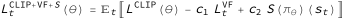

The solution to this project is based on very simple state of the art [OpenAI : Proximal Policy Optimization](https://arxiv.org/pdf/1707.06347) algorithm.
Which has a tendency of overfiting a complex problem space by densely sampling it. Very good for situations where simulation is cheap. 

## Unstable Update Problem

In supervised learning, a bad gradient update while processing a batch is corrected in next batch, 
because the examples are labeled correctly.

But in reinforcement learning based supervised learning, in absence of labeled data, this poses a huge risk.
1. A large update in wrong direction, will destroy the current policy.
1. Next batch generated by this bad policy will generate wrong examples.
1. And these bad examples will diverge the policy further into wrong direction in subsequent updates.

A vicious cycle. 

**TRPO** and **PPO** algorithms addresses exactly this problem, by limiting the update in each step 
by defining novel objective functions.

## Learning Algorithm

**PPO** is an **_online policy gradient_** algorithm where experiences are collected based on the current policy, 
deviation from real values are learned upon and then those experiences are discarded. 

As opposed to _offline learning_ algorithm (used in DQN), where all past experiences are banked in a _Replay Buffer_ to be used in training. 

The main algorithm goes like

* for `i_episode` in 1 .. `num_episodes`. <sub><sup>[train.py#train()](train.py#L15)</sup></sub>
  * **Collect trajectories:** for `agent` in 1  .. `num_agents` (in parallel). <sub><sup>[ppo_agent.py#run_episode()](ppo_agent.py#L37)</sup></sub>
     - Use the old policy. <sub><sup>[model.py#ActorCriticModel](model.py#L51)</sup></sub> 
     - Interact with the environment for `max_steps`. <sub><sup>[ppo_agent.py#collect_trajectories()](ppo_agent.py#L44)</sup></sub>
  * **Compute Advantage Estimates:**
    - Based on [Generalized Advantage Estimation](https://arxiv.org/abs/1506.02438) algorithm for each collected trajectory. <sub><sup>[ppo_agent.py#compute_advantage_estimates()](ppo_agent.py#L88)</sup></sub>
  * **Learn**:
    - Given the collected trajectories and their corresponding advantage estimates
    - Optimize surrogate Lᶿ wrt θ for `num_epochs` and `mini_batch_size` ≤ `num_agents * max_steps`. <sub><sup>[ppo_agent.py#learn()](ppo_agent.py#L135)</sup></sub>
  * **Discard the experiences:** Collected so far.

## Model

The [ActorCriticModel\(model.py\)](model.py#L51) used in the algorithm comprises of
* [PolicyModel\(model.py\)](model.py#L13) acting as an Actor:
   - It predicts actions given a state.
   - Input layer has a size of `num_states = 33`
   - Two FC hidden layers of size `(64, 64)` each gated by `relu`
   - Output layer of size `num_actions = 4` gated by `tanh`
* [ValueModel\(model.py\)](model.py#L32) acting as a Critic:
   - It predicts an estimate of the discounted return from the given state onward.
   - Input layer has a size of `num_states = 33`
   - Two FC hidden layers of size `(64, 64)` each gated by `relu`
   - Output layer of size `1` gated by `tanh`
* Unlike for discrete action space, where the network emits action choice probabilities, 
  here a Gaussian distribution maps the output of the Policy model to continuous space.
  During training the policy is sampled from this distribution to get continuous values for actions.


## Advantage Estimation


* **Discounted Sum of rewards:** is based on the actual rewards collected during the interaction with the environment.
* **Baseline Estimate:** is the value function of the ActorCritic Model, where it tries to estimate what should have been the reward this point onward, given the current state.

- A +ve **Â** means that, the agent performed **better** than our estimate.
- A -ve **Â** means that, the performed **worse** than our estimate.


### Generalized Advantage Estimation (GAE)

A neural network based value function, allows to estimate the goodness of an action before the delayed reward arrives,
an elegant solution to the **credit assignment** problem. Though noisy gradient estimates scales unfavourably with the time horizon
, introducing high bias and variance.  

**GAE** reduces the variance while maintaining a tolerable level of bias, which can be controlled by parameters γ(gamma)
and λ (lambda). 


This is also suitable for the RNN based models used in original **PPO** implementation, for trajectories of fixed length timestamp. 


## Objective functions

### Vanilla Policy Gradient

In a vanilla policy gradient algorithm, the objective is generally stated as


* Advantage **Â** when +ve will increase the probabilities of selecting the action again in future.
* Advantage **Â** when -ve will penalize the probabilities of selecting the action again in future.

Given the fact that Advantage is an estimation based on noisy prediction of the Critic network, 
this is subjected to the problem of **Unstable update** as stated above.

### Importance Sampling

Another alternative version of writing a policy gradient is based on the following formula, also called 
as **Importance Sampling**. In plain word it represents, what would the expectation be under one distribution, 
even though the sampling was done with an another distribution.  

Mathematically this is very similar to the **Vanila Policy Gradient** objective function.


* The ratio above is
   - _equal to 1_ when the current policy action matches the old policy
   - _large than 1_ if the action is more likely now than the old version of the policy
   - _between 0 and 1_ if action is less likely now than the old version of the policy

This is stil subjected to the problem of **Unstable update**.

### Trusted Region Policy Optimization (TRPO)

In this paper, the authors defined a technique where policy update from the objective function,


happens in a controlled **trusted region**, subjected to the KL divergence term as mentioned bellow.


This actually solves the problem of **Unstable update**, but the constrained optimization function 
is bit complex implementation wise, and is not directly included inside the objective function.

### Proximal Policy Optimization (PPO)

The authors of the PPO algorithm wanted the goodness of the TRPO algorithm, 
but wanted to keep it very simple implementation wise. 

There are three terms in the final objective function



**Clipped surrogate objective**


Where


* First term inside the _min_ function, is a normal TRPO objective which pushes the policy towards actions 
that yield a high positive advantage over the baseline
* The _clip_ function is similar to the first time, but truncated, it makes sure that the probability ratio is not too far from 1.
* Finally the _min_ function creates a element wise function, 
which navigates the overall objective function. Such that the policy update is the orginal TRPO function 
   - when  Â is +ve (good example), the gradient is leveraged
   - when  is -ve (bad example), it allows the gradient to be rolled back by an amount proportional to how bad the current situation is.

**Value loss**


- Measure of how good it is to be in current state.

**Entropy loss**


- Makes sure that our agent does enough exploration during training.
- Measures how unpredictable the action space distribution is.
- Maximizing this will force a wide spread over all the possible 
actions resulting in the most unpredictable outcome.

## Hyperparameters

```python
optimizer               = Adam
lr                      = 3e-4
gamma                   = 0.995
gae_lambda              = 0.95
num_epochs              = 10
mini_batch_size         = 512
clip_eps                = 0.2
coeff_value_loss(c1)    = 0.5
coeff_entropy_loss(c2)  = 0.01
num_episodes            = 2000
max_steps               = 1000
```

## Plot of rewards
The environment is solved in 259 episodes.


### Logs

[Full log file](docs/train.log)

```
...
INFO:train.py:[255/2000] score=29.92, avg = 29.94, best = 29.94, steps = 1000
INFO:train.py:[256/2000] score=30.11, avg = 29.94, best = 29.94, steps = 1000
INFO:model.py:saving checkpoint to : checkpoints/Reacher.ppo.best
INFO:train.py:[257/2000] score=32.18, avg = 29.97, best = 29.97, steps = 1000
INFO:model.py:saving checkpoint to : checkpoints/Reacher.ppo.best
INFO:train.py:[258/2000] score=31.43, avg = 29.99, best = 29.99, steps = 1000
INFO:model.py:saving checkpoint to : checkpoints/Reacher.ppo.best
INFO:train.py:[259/2000] score=30.37, avg = 30.01, best = 30.01, steps = 1000
INFO:train.py:Environment solved in 259 episodes
INFO:model.py:saving checkpoint to : checkpoints/Reacher.ppo.solved
...
```

## Ideas of future work

* Extending this implementation to multi-agent self play environments, like it was done in [OpenAI Five](https://blog.openai.com/openai-five/)

## Reference Papers
* [Proximal Policy Optimization](https://arxiv.org/pdf/1707.06347)
* [Trust Region Policy Optimization](https://arxiv.org/pdf/1502.05477)
* [Generalized Advantage Estimation](https://arxiv.org/abs/1506.02438)

## Credits

* [CS885 Lecture 15b: Proximal Policy Optimization (Presenter: Ruifan Yu)](https://www.youtube.com/watch?v=wM-Sh-0GbR4)
* [Deep RL Bootcamp Lecture 5: Natural Policy Gradients, TRPO, PPO - John Schulman OpenAI](https://www.youtube.com/watch?v=xvRrgxcpaHY)
* [Policy Gradient methods and Proximal Policy Optimization (PPO): diving into Deep RL!](https://www.youtube.com/watch?v=5P7I-xPq8u8)
* [A Short Introduction to Entropy, Cross-Entropy and KL-Divergence](https://www.youtube.com/watch?v=ErfnhcEV1O8)
* [higgsfield/RL-Adventure-2 PPO Jupyter Notebook](https://github.com/higgsfield/RL-Adventure-2/blob/master/3.ppo.ipynb)
* [higgsfield/RL-Adventure-2 GAE Jupyter Notebook](https://github.com/higgsfield/RL-Adventure-2/blob/master/2.gae.ipynb)
* [ShangtongZhang/DeepRL PPO_agent](https://github.com/ShangtongZhang/DeepRL/blob/master/deep_rl/agent/PPO_agent.py)
* [PPO2 OpenAI baseline](https://github.com/openai/baselines/tree/master/baselines/ppo2)
* [OpenAI Five](https://blog.openai.com/openai-five/)

